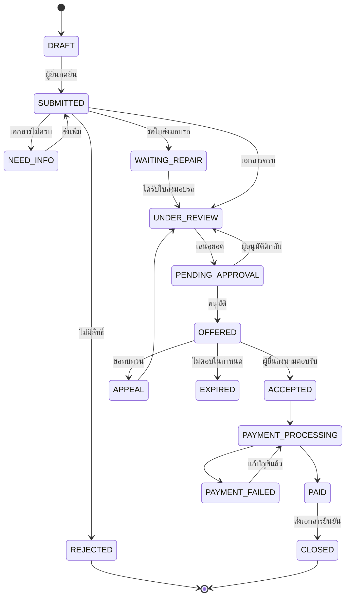

# Customer Journey: Web App แจ้งและติดตามค่าขาดประโยชน์ (ประกันรถยนต์)

> เอกสารออกแบบ v0.3 — อัปเดตตามข้อสรุปขอบเขตงาน · โปรแกรมจำลอง: [`prototype/index.html`](../prototype/index.html)

## 0. ข้อสรุปขอบเขต (Decisions)

| หัวข้อ | ข้อสรุป |
|---|---|
| วัตถุประสงค์ | Web App สนับสนุนบริการของบริษัท (ไม่ใช่ตัวกลาง/ตัวแทนลูกค้า) |
| ผู้ยื่น | **คู่กรณีฝ่ายถูกเท่านั้น** ยื่นแบบฟอร์มเอง (self-service) |
| ผู้พิจารณา | **บริษัทพิจารณาวงเงิน** ผ่านระบบหลังบ้าน (Back Office) |
| การจ่ายเงิน | บริษัทโอนเข้าบัญชีของ **คู่กรณี (เจ้าของรถ)** ผ่าน **API ธนาคาร** (ในโปรแกรมจำลองเป็นการจำลอง) |
| การเชื่อมต่อระบบ | ระยะนี้เป็น **โปรแกรมจำลอง** ใช้ข้อมูลจำลอง ไม่เชื่อม API ใด |
| ช่องทาง | **Web App** (responsive ใช้บนมือถือได้) |
| ขอบเขต | **เรียกร้องค่าขาดประโยชน์จากประกันรถยนต์** เท่านั้น |

---

## 1. ผู้เกี่ยวข้อง (Actors)

| Actor | ฝั่ง | บทบาท |
|---|---|---|
| **ผู้ยื่นคำร้อง (Claimant)** — คู่กรณีฝ่ายถูก | Front (Web App) | กรอกแบบฟอร์ม แนบเอกสาร ติดตามสถานะ ตอบรับข้อเสนอ รับเงิน |
| **เจ้าหน้าที่ตรวจเอกสาร (Reviewer)** | Back Office | ตรวจความครบถ้วน/ความถูกต้อง ขอเอกสารเพิ่ม |
| **ผู้พิจารณาวงเงิน (Approver)** | Back Office | อนุมัติยอดตามอำนาจวงเงิน |
| **ฝ่ายการเงิน (Finance)** | Back Office | ตรวจบัญชีผู้รับเงิน สั่งโอน ยืนยันการจ่าย |
| **ระบบเคลมหลัก (Core Claim System)** | Integration | แหล่งข้อมูลเลขเคลม กรมธรรม์ ฝ่ายถูก/ผิด |

---

## 2. ภาพรวม Journey ฝั่งผู้ยื่น (10 ขั้น)

```
1 เข้าเว็บ & ตรวจสิทธิ์ → 2 ยืนยันตัวตน & ยินยอม → 3 กรอกแบบฟอร์มคำร้อง → 4 แนบเอกสาร & ยื่น
→ 5 รอตรวจ (ขอเอกสารเพิ่มถ้าไม่ครบ) → 6 ติดตามสถานะ → 7 รับผลพิจารณาวงเงิน
→ 8 ตอบรับ / ขอทบทวน → 9 รับเงิน → 10 รับเอกสารยืนยัน & ปิดเคส
```

---

## 3. รายละเอียดแต่ละขั้น

### ขั้น 1 — เข้าเว็บ & ตรวจสิทธิ์เบื้องต้น
- **ช่องทางเข้า:** ลิงก์/QR ที่พนักงานสำรวจภัยให้ ณ จุดเกิดเหตุ, SMS แจ้งเลขเคลม, หน้าเว็บบริษัท
- **ผู้ยื่นทำ:** กรอก **เลขเคลม + ทะเบียนรถ** → ระบบตรวจกับระบบเคลมหลัก
- **ระบบตรวจ:**
  - เลขเคลมมีอยู่จริง และผู้ยื่นเป็นฝ่ายที่มีสิทธิ์เรียกร้อง (ฝ่ายถูก)
  - ยังไม่เคยยื่นค่าขาดประโยชน์สำหรับเคลม/รถคันนี้ (กันยื่นซ้ำ)
  - ยังอยู่ในอายุความ (แสดงวันครบกำหนด)
- **ผลลัพธ์:** ✅ ยื่นได้ | ⚠️ ข้อมูลไม่ตรง → ติดต่อเจ้าหน้าที่ | ❌ ไม่มีสิทธิ์ → แสดงเหตุผล
- **ฟีเจอร์เสริม:** เครื่องคำนวณยอดประมาณการ (ประเภทรถ × จำนวนวัน) ก่อนเริ่ม

### ขั้น 2 — ยืนยันตัวตน & ให้ความยินยอม
- ยืนยันด้วย **OTP เบอร์มือถือ** (ควรตรงกับเบอร์ในระบบเคลม)
- กรอกเลขบัตรประชาชน / อัปโหลดบัตร
- ยินยอม **PDPA** (แยกข้อ: ใช้ข้อมูลพิจารณาคำร้อง / การตลาด-ไม่บังคับ)
- ระบุว่าผู้ยื่นเป็น: เจ้าของรถ / ผู้ครอบครอง (เช่ารถ, ลีสซิ่ง) / ผู้รับมอบอำนาจ

### ขั้น 3 — กรอกแบบฟอร์มคำร้อง
| ส่วน | ข้อมูล |
|---|---|
| ข้อมูลผู้ยื่น | ชื่อ, ที่อยู่, เบอร์, อีเมล |
| ข้อมูลรถ | ทะเบียน, ยี่ห้อ/รุ่น, **ประเภทรถ** (กำหนดอัตราต่อวัน), การใช้งาน (ส่วนบุคคล/รับจ้าง/พาณิชย์) |
| ข้อมูลการซ่อม | อู่/ศูนย์, **วันที่รถเข้าซ่อม**, **วันที่ซ่อมเสร็จ/คาดว่าเสร็จ** |
| ประเภทการเรียกร้อง | (ก) ตามอัตรามาตรฐานรายวัน (ข) ค่าเช่ารถทดแทนตามจริง (ค) รายได้ที่ขาด (รถรับจ้าง/พาณิชย์) |
| จำนวนเงินที่ขอ | ระบบคำนวณให้อัตโนมัติ ผู้ยื่นแก้ได้พร้อมเหตุผล |
| **บัญชีรับเงิน** | ธนาคาร, เลขบัญชี, **ชื่อบัญชี (ต้องตรงกับผู้มีสิทธิ์รับเงิน)** |

- บันทึกร่างได้ กลับมากรอกต่อได้

### ขั้น 4 — แนบเอกสาร & ยื่นคำร้อง
| เอกสาร | บังคับ | หมายเหตุ |
|---|---|---|
| บัตรประชาชนผู้ยื่น | ✅ | |
| สำเนาทะเบียนรถ | ✅ | ยืนยันความเป็นเจ้าของ |
| หน้าสมุดบัญชีธนาคาร | ✅ | ชื่อต้องตรงกับผู้รับเงิน |
| ใบรับรถเข้าซ่อม | ✅ | เริ่มนับวัน |
| ใบส่งมอบรถ / ใบเสร็จค่าซ่อม | ✅ (ยื่นทีหลังได้) | ปิดนับวัน |
| ใบเสร็จค่าเช่ารถทดแทน | กรณี (ข) | |
| หลักฐานรายได้ (สเตทเมนต์ ใบงาน) | กรณี (ค) | |
| หนังสือมอบอำนาจ + บัตรเจ้าของรถ | ถ้าผู้ยื่น/ผู้รับเงินไม่ใช่เจ้าของรถ | |
| สัญญาเช่าซื้อ/ลีสซิ่ง | ถ้ารถติดไฟแนนซ์ | อาจต้องหนังสือยินยอมจากไฟแนนซ์ |

- ผู้ยื่นตรวจสรุปข้อมูล → รับรองความถูกต้อง → กดยื่น
- ได้ **เลขคำร้อง** + อีเมล/SMS ยืนยัน → สถานะ `SUBMITTED`

### ขั้น 5 — บริษัทตรวจเอกสาร
- Reviewer ตรวจภายใน SLA (เช่น 2 วันทำการ)
- ไม่ครบ/ไม่ชัด → สถานะ `NEED_INFO` + ระบุรายการที่ขาด → ผู้ยื่นได้แจ้งเตือนและอัปโหลดเพิ่มในหน้าเคสเดิม
- ถ้ารถยังซ่อมไม่เสร็จ → สถานะ `WAITING_REPAIR` (รอใบส่งมอบรถ)

### ขั้น 6 — ติดตามสถานะ
- หน้า **Dashboard เคส:** สถานะปัจจุบัน, timeline ทุกเหตุการณ์, เอกสารที่ส่งแล้ว, สิ่งที่ต้องทำต่อ
- แจ้งเตือนทาง SMS/อีเมลทุกครั้งที่สถานะเปลี่ยน

### ขั้น 7 — รับผลพิจารณาวงเงิน
**หลังบ้าน:**
1. ระบบคำนวณ **ยอดแนะนำ** = จำนวนวันที่สมเหตุสมผล × อัตราต่อวันตามประเภทรถ (+ ค่าใช้จ่ายจริงที่มีหลักฐาน)
2. Reviewer ปรับจำนวนวัน/ยอดได้ แต่ **ต้องระบุเหตุผล** (เช่น ตัดวันที่ซ่อมล่าช้าเพราะผู้ยื่นไม่นำรถเข้าซ่อม)
3. ส่งอนุมัติตาม **อำนาจวงเงิน** (ดูข้อ 5)

**ผู้ยื่นได้รับ:** หนังสือแจ้งผลพิจารณา แสดง จำนวนวันที่อนุมัติ × อัตรา = ยอดเงิน และเหตุผลกรณีอนุมัติต่ำกว่าที่ขอ → สถานะ `OFFERED`

### ขั้น 8 — ตอบรับ หรือ ขอทบทวน
- **ตอบรับ:** อ่าน **หนังสือยินยอมรับค่าสินไหมทดแทน** (ไฮไลต์: "เมื่อรับเงินแล้วจะไม่เรียกร้องเพิ่มในเหตุเดียวกัน") → ลงนามอิเล็กทรอนิกส์ (OTP sign) → `ACCEPTED`
- **ขอทบทวน:** ระบุเหตุผล + แนบหลักฐานเพิ่ม (จำกัด 1–2 ครั้ง) → กลับไปขั้นพิจารณา → `APPEAL`
- **ไม่ตอบใน X วัน:** แจ้งเตือน 2 ครั้ง → ถ้ายังไม่ตอบ `EXPIRED` (เปิดใหม่ได้โดยติดต่อเจ้าหน้าที่)
- แสดงช่องทางร้องเรียน คปภ. 1186 ในกรณีไม่เห็นด้วยกับผลพิจารณา

### ขั้น 9 — รับเงิน
- Finance ตรวจ **ชื่อบัญชีตรงกับผู้มีสิทธิ์รับเงิน** (เจ้าของรถ หรือผู้รับมอบอำนาจที่มีเอกสารครบ)
- สั่งโอน → สถานะ `PAYMENT_PROCESSING` → โอนสำเร็จ `PAID`
- ผู้ยื่นเห็นวันที่โอน, ยอด, ธนาคารปลายทาง (ปิดเลขบัญชีบางส่วน)
- โอนไม่สำเร็จ (บัญชีปิด/ชื่อไม่ตรง) → `PAYMENT_FAILED` → ให้ผู้ยื่นแก้ไขบัญชี (ต้องยืนยัน OTP ใหม่ + ตรวจซ้ำ)

### ขั้น 10 — รับเอกสารยืนยัน & ปิดเคส
ดาวน์โหลดได้จากหน้าเคส + ส่งทางอีเมล:
1. **หนังสือยืนยันการจ่ายค่าขาดประโยชน์** (เลขคำร้อง, เลขเคลม, ยอด, วันที่โอน, บัญชีปลายทาง)
2. สำเนาหนังสือยินยอมรับค่าสินไหมที่ลงนาม
3. สรุปการพิจารณา (จำนวนวัน × อัตรา)

- สถานะ `CLOSED` → แบบประเมินความพึงพอใจ

---

## 4. สถานะคำร้อง (State Machine)



---

## 5. Back Office: การพิจารณาวงเงิน

### อำนาจอนุมัติวงเงิน (อนุมัติตามลำดับ Step)
| ยอดอนุมัติ | ต้องอนุมัติถึง |
|---|---|
| ไม่เกิน 5,000 บาท | Step 1 · เจ้าหน้าที่สินไหม |
| 5,001 – 20,000 บาท | Step 1 → Step 2 · หัวหน้าทีมสินไหม |
| เกิน 20,000 บาท | Step 1 → Step 2 → Step 3 · ผู้จัดการฝ่ายสินไหม |

> ⚠️ ช่วง 20,001–50,000 บาท ยังไม่ได้กำหนด — โปรแกรมจำลองให้ไป Step 3 ไว้ก่อน (ปลอดภัยกว่า) รอยืนยัน

### ตาราง Config ที่ต้องมี
- **อัตราค่าขาดประโยชน์ต่อวัน** ตามประเภทรถ (มี `effective_from` / `effective_to` เพราะอัตราอ้างอิง คปภ. อาจเปลี่ยน)
- **จำนวนวันซ่อมอ้างอิง** ตามระดับความเสียหาย (ใช้เตือนเมื่อจำนวนวันผิดปกติ)
- อำนาจวงเงิน, SLA แต่ละขั้น, จำนวนครั้งที่ขอทบทวนได้

### การป้องกันความเสี่ยง
- กันยื่นซ้ำ: 1 เลขเคลม + 1 ทะเบียน = 1 คำร้องที่ active
- ตรวจชื่อบัญชีกับชื่อเจ้าของรถ/ผู้รับมอบอำนาจ
- แก้ไขบัญชีรับเงินต้องยืนยัน OTP + Finance ตรวจซ้ำ
- Audit log ทุกการแก้ไขยอด/สถานะ (ใคร, เมื่อไหร่, เหตุผล)
- แยกสิทธิ์ (maker–checker): ผู้เสนอยอด ≠ ผู้อนุมัติ ≠ ผู้สั่งจ่าย

---

### ประเภทอู่และตัวชี้วัดการซ่อม
| ประเภท | ลักษณะ |
|---|---|
| **อู่ห้าง (Dealer Garage)** | ศูนย์บริการของผู้ผลิตรถ ค่าซ่อมสูงกว่า เวลาซ่อมใกล้มาตรฐาน |
| **อู่นอก (General Garage)** | อู่อิสระ ค่าซ่อมถูกกว่า แต่มักใช้เวลาซ่อมนานกว่า ทำให้ค่าขาดประโยชน์สูงขึ้น |

- **ดัชนีเวลาซ่อม (RTI)** = วันซ่อมจริง ÷ วันมาตรฐานตามระดับความเสียหาย (เล็กน้อย 5 / ปานกลาง 10 / หนัก 18 วัน — ค่าจำลอง)
- **ตรงนัด** = % เคสที่รับรถได้ไม่เกินวันที่อู่นัด
- **ดัชนีต้นทุน** = (ค่าซ่อม + ค่าขาดประโยชน์) ÷ ค่าเฉลี่ยของเคสระดับความเสียหายเดียวกัน
- **ส่วนเกินจากความล่าช้า** = (วันที่จ่าย − วันมาตรฐาน) × อัตราต่อวัน
- **คะแนนอู่ (0–100)** = 50% เวลา + 25% ตรงนัด + 25% ต้นทุน → เกรด A/B/C/D

### รายงานผู้จัดการฝ่ายสินไหม (ในโปรแกรมจำลอง)
ภาพรวม KPI · เรื่องที่ต้องดูวันนี้ (เกิน SLA, รอ Step 3, ปรับลดจนต่ำกว่าเส้นอำนาจ, บัญชีซ้ำ, ซ่อมเกิน 30 วัน, โอนไม่สำเร็จ) · ยอดจ่ายรายเดือน · งานค้างและอายุงาน · สายอนุมัติ · ยอดขอเทียบยอดอนุมัติ · อู่ห้างเทียบอู่นอก · คะแนนอู่

## 6. การแจ้งเตือน

| เหตุการณ์ | ช่องทาง | ถึง |
|---|---|---|
| ยื่นคำร้องสำเร็จ (เลขคำร้อง) | SMS + Email | ผู้ยื่น |
| ขอเอกสารเพิ่ม | SMS + Email | ผู้ยื่น |
| มีผลพิจารณา (ต้องตอบรับ) | SMS + Email | ผู้ยื่น |
| ใกล้หมดเวลาตอบรับ | SMS | ผู้ยื่น |
| โอนเงินสำเร็จ / ไม่สำเร็จ | SMS + Email | ผู้ยื่น |
| เอกสารยืนยันพร้อมดาวน์โหลด | Email | ผู้ยื่น |
| เคสเกิน SLA / รออนุมัติ | Email/ในระบบ | เจ้าหน้าที่ / ผู้อนุมัติ |

---

## 7. หน้าจอหลัก

**ฝั่งผู้ยื่น (Web App):** หน้าแรก+คำนวณยอด · ตรวจสิทธิ์ (เลขเคลม+ทะเบียน) · OTP/ยินยอม · แบบฟอร์ม (หลายขั้น) · อัปโหลดเอกสาร · สรุปก่อนยื่น · Dashboard เคส · หน้าผลพิจารณา/ลงนาม · หน้าเอกสารยืนยัน

**ฝั่ง Back Office:** คิวงาน (กรองตามสถานะ/SLA) · หน้าตรวจเคส (เอกสาร+เครื่องคำนวณ+ประวัติ) · คิวอนุมัติ · คิวจ่ายเงิน · ตั้งค่าอัตรา/วงเงิน · รายงาน

---

## 8. ขอบเขต MVP ที่เสนอ

**MVP:** ขั้น 1–10 ครบ, ตรวจเลขเคลมกับระบบหลัก (หรือ import ไฟล์ถ้ายังไม่มี API), คำนวณยอดอัตโนมัติ, อนุมัติตามวงเงิน, ลงนามด้วย OTP, สร้าง PDF เอกสารยืนยัน, แจ้งเตือน SMS/Email

**เฟสถัดไป:** OCR อ่านเอกสาร, e-KYC, โอนเงินอัตโนมัติผ่าน API ธนาคาร, LINE notification, dashboard สถิติผู้บริหาร, ตรวจจับทุจริตขั้นสูง

---

## 9. คำถามที่ยังเปิดอยู่
1. ~~API ระบบเคลมหลัก~~ → ระยะนี้ใช้ข้อมูลจำลอง
2. ~~ช่องทางโอนเงิน~~ → เชื่อม API ธนาคาร (ระยะนี้จำลอง)
3. SLA จริงของแต่ละขั้น
4. ยอด 20,001–50,000 บาท ต้องอนุมัติถึง Step ไหน?

*หมายเหตุ: อัตรา อายุความ และข้อความในหนังสือยินยอม ควรให้ฝ่ายกฎหมาย/กำกับดูแลตรวจสอบก่อนใช้งานจริง*
