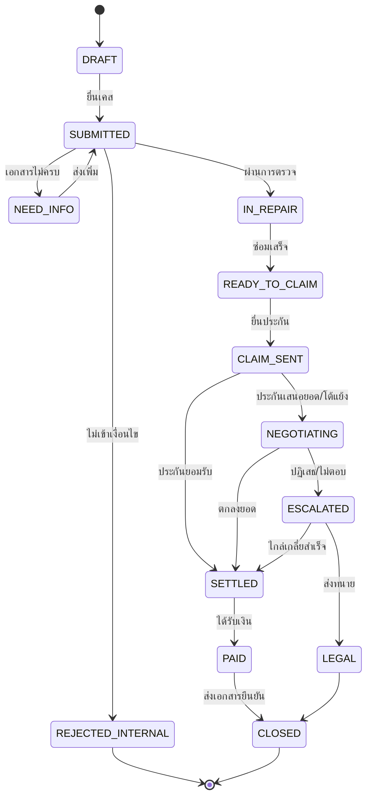

# Customer Journey: ระบบแจ้งและติดตามค่าขาดประโยชน์

> เอกสารออกแบบเบื้องต้น (v0.1) — ใช้ก่อนเริ่มออกแบบหน้าจอและฐานข้อมูล
> ขอบเขต MVP: **คู่กรณีฝ่ายถูก (ผู้เสียหาย) รถถูกชน** เรียกค่าขาดประโยชน์ระหว่างซ่อมจาก **บริษัทประกันของคู่กรณี**

---

## 1. ผู้เกี่ยวข้อง (Actors)

| Actor | บทบาท |
|---|---|
| **ผู้เสียหาย (ลูกค้า)** | เจ้าของรถ / ผู้ครอบครองรถที่ถูกชน เป็นผู้ใช้หลักของระบบ |
| **เจ้าหน้าที่ (Case Officer)** | ตรวจเอกสาร ประเมินยอด ติดต่อบริษัทประกันแทนลูกค้า (ถ้ามีหนังสือมอบอำนาจ) |
| **บริษัทประกันคู่กรณี** | ผู้พิจารณาและจ่ายเงิน |
| **อู่ / ศูนย์ซ่อม** | ออกใบรับรถ–ใบส่งมอบรถ (ยืนยันจำนวนวันที่ขาดประโยชน์) |
| **คปภ. / ทนาย (ทางเลือก)** | ช่องทางยกระดับเมื่อเจรจาไม่สำเร็จ |

### Persona ตัวอย่าง
- **คุณเอ (พนักงานออฟฟิศ)** — รถเก๋งถูกชนท้าย ไม่รู้ว่าเรียกค่าขาดประโยชน์ได้ ไม่มีเวลาโทรตามประกัน ต้องการแค่ "ยื่นครั้งเดียวแล้วรู้สถานะ"
- **คุณบี (คนขับรถส่งของ/แท็กซี่)** — รถคือรายได้ ขาดรายได้วันละ 1,000+ บาท ต้องการเรียกเกินอัตรามาตรฐานพร้อมหลักฐานรายได้

---

## 2. ภาพรวม Journey (12 ขั้น)

```
[0 เกิดเหตุ] → 1 รู้จักบริการ → 2 ติดต่อ & คัดกรองสิทธิ์ → 3 สมัคร/ยืนยันตัวตน/ยินยอม
→ 4 แจ้งเคส & อัปโหลดเอกสาร → 5 ตรวจเอกสาร & ประเมินยอด → 6 ติดตามระหว่างซ่อม
→ 7 รถซ่อมเสร็จ (ปิดยอดวัน) → 8 ยื่นเรียกร้องต่อประกัน → 9 เจรจา/ติดตาม (ยกระดับ คปภ.)
→ 10 ตกลงยอด & ลงนาม → 11 รับเงิน → 12 รับเอกสารยืนยัน & ปิดเคส
```

---

## 3. รายละเอียดแต่ละขั้น

### ขั้น 0 — เกิดเหตุ (ก่อนเข้าระบบ)
- **ลูกค้าทำอะไร:** ถูกชน, ประกันมาที่เกิดเหตุ, ได้ **ใบเคลม / ใบรับแจ้งอุบัติเหตุ** ระบุว่าคู่กรณีเป็นฝ่ายผิด, อาจแจ้งความ
- **ความรู้สึก:** 😟 เครียด สับสน
- **โอกาสของระบบ:** หน้า "เพิ่งถูกชน? ทำ 5 อย่างนี้ก่อน" (ถ่ายรูป, เก็บใบเคลม, ขอเลขกรมธรรม์คู่กรณี) — เป็น content ดึงลูกค้า

### ขั้น 1 — รู้จักบริการ (Awareness)
- **ช่องทาง:** LINE OA, Facebook/Google, อู่พาร์ทเนอร์แนะนำ, QR ที่อู่
- **ลูกค้าคิด:** "เรียกได้จริงเหรอ? ได้เท่าไหร่? เสียค่าใช้จ่ายไหม?"
- **ระบบต้องมี:** หน้า landing + **เครื่องคำนวณยอดเบื้องต้น** (ประเภทรถ × จำนวนวันซ่อม) ไม่ต้องสมัคร
- **KPI:** อัตราคลิกจาก calculator → เริ่มเคส

### ขั้น 2 — ติดต่อครั้งแรก & คัดกรองสิทธิ์ (Eligibility Check)
คำถามคัดกรอง 5 ข้อ (ตอบใน 1 นาที):
1. คู่กรณีเป็นฝ่ายผิดหรือไม่? (ใบเคลมระบุ / ยังไม่ชัด)
2. คู่กรณีมีประกันภาคสมัครใจหรือไม่? (ชั้น 1/2/3/ไม่มี)
3. วันเกิดเหตุ → **ระบบคำนวณอายุความอัตโนมัติ**
   - ฟ้องผู้ทำละเมิด: 1 ปีนับแต่รู้ถึงการละเมิดและรู้ตัวผู้ต้องรับผิด (ป.พ.พ. ม.448)
   - ฟ้องบริษัทประกันโดยตรง: 2 ปีนับแต่วันเกิดเหตุ (ม.882)
4. รถเข้าซ่อมแล้วหรือยัง / ซ่อมเสร็จแล้วหรือยัง
5. ใช้รถเพื่อหารายได้หรือไม่ (แยก flow มาตรฐาน vs. รายได้จริง)

- **ผลลัพธ์:** ✅ มีสิทธิ์ → ไปขั้น 3 | ⚠️ ไม่ชัด → นัดคุยเจ้าหน้าที่ | ❌ ไม่เข้าเงื่อนไข → อธิบายเหตุผล + ทางเลือก
- **Pain point:** ลูกค้าไม่รู้ว่าฝ่ายผิดคือใคร → ให้ถ่ายรูปใบเคลมแล้วระบบ/เจ้าหน้าที่ช่วยอ่าน

### ขั้น 3 — สมัคร / ยืนยันตัวตน / ให้ความยินยอม
- เข้าสู่ระบบด้วยเบอร์โทร (OTP) หรือ LINE Login
- ยืนยันตัวตน: บัตรประชาชน (+ selfie ถ้าต้อง e-KYC)
- **ความยินยอม PDPA:** แยกข้อ — ใช้ข้อมูลเพื่อดำเนินเคส / ส่งข้อมูลให้บริษัทประกัน / การตลาด (optional)
- **หนังสือมอบอำนาจ (e-sign)** ถ้าให้บริษัทเป็นตัวแทนติดต่อประกัน
- แสดง **ค่าบริการ / ส่วนแบ่ง** ให้ชัดก่อนเริ่ม (ดูข้อ 7 คำถามที่ต้องตัดสินใจ)

### ขั้น 4 — แจ้งเคส & อัปโหลดเอกสาร
| เอกสาร | จำเป็น | ใช้ทำอะไร |
|---|---|---|
| ใบเคลม / ใบรับแจ้งอุบัติเหตุ (ระบุฝ่ายผิด) | ✅ | ยืนยันความรับผิด |
| สำเนาทะเบียนรถ (เล่มเขียว) | ✅ | ยืนยันความเป็นเจ้าของ |
| บัตรประชาชน | ✅ | ยืนยันตัวตน |
| สมุดบัญชีธนาคาร (หน้าแรก) | ✅ | รับเงิน |
| รูปความเสียหาย | ✅ | ประกอบเคส |
| ใบรับรถเข้าอู่ (วันที่รับ) | ✅ | เริ่มนับวัน |
| ใบส่งมอบรถ (วันที่ซ่อมเสร็จ) | ✅ (ตอนขั้น 7) | ปิดนับวัน |
| บันทึกประจำวันตำรวจ | แนะนำ | หลักฐานเสริม |
| ใบเสร็จค่าเช่ารถ/แท็กซี่ | ทางเลือก | เรียกตามจริง |
| หลักฐานรายได้ (สเตทเมนต์, ใบงาน) | เฉพาะรถหารายได้ | เรียกเกินอัตรามาตรฐาน |
| หนังสือมอบอำนาจ (กรณีไม่ใช่เจ้าของ) | กรณีพิเศษ | |

- **UX:** checklist แสดงความคืบหน้า, OCR อ่านเลขเคลม/ทะเบียน/วันที่อัตโนมัติ, อัปโหลดทีหลังได้
- **ผลลัพธ์:** ได้ **เลขเคส** + สถานะ `SUBMITTED`

### ขั้น 5 — ตรวจเอกสาร & ประเมินยอด
- เจ้าหน้าที่ตรวจภายใน **SLA 1 วันทำการ** → ถ้าขาด: ขอเอกสารเพิ่ม (สถานะ `NEED_INFO`)
- **สูตรประเมิน (ปรับได้):**
  ```
  ยอดเรียกร้อง = (วันส่งมอบรถ − วันรับรถเข้าอู่ + 1) × อัตราต่อวัน
                + ค่าใช้จ่ายจริงที่มีใบเสร็จ (ถ้าเลือก flow ตามจริง)
  ```
  อัตราต่อวันอ้างอิงคำแนะนำ คปภ. ตามประเภทรถ (เก็บเป็น **ตาราง config มีวันที่มีผล** เพราะอัตราอาจเปลี่ยน)
- ระบบแจ้งลูกค้า: "ยอดประเมิน ณ ตอนนี้ X บาท (อัปเดตทุกวันจนรถซ่อมเสร็จ)"
- **ความเสี่ยง:** ซ่อมนานผิดปกติ → ศาล/ประกันอาจตัดวันที่ไม่สมเหตุสมผล → ระบบเตือนเมื่อเกินค่ากลางของงานซ่อมประเภทนั้น

### ขั้น 6 — ติดตามระหว่างซ่อม
- ตัวนับวันแบบ real-time บน dashboard
- แจ้งเตือนทุกสัปดาห์ / เมื่ออู่อัปเดต (ถ้าอู่เป็นพาร์ทเนอร์)
- ลูกค้ากด "รถยังไม่เสร็จ — อู่รออะไหล่" เพื่อบันทึกเหตุผลความล่าช้า (หลักฐานว่าไม่ใช่ความผิดลูกค้า)

### ขั้น 7 — รถซ่อมเสร็จ (ปิดยอดวัน)
- ลูกค้าอัปโหลดใบส่งมอบรถ → ระบบล็อกจำนวนวัน → สถานะ `READY_TO_CLAIM`
- แสดงยอดสุดท้ายให้ลูกค้า **ยืนยันก่อนยื่น**

### ขั้น 8 — ยื่นเรียกร้องต่อบริษัทประกัน
- ระบบสร้าง **หนังสือเรียกร้องค่าขาดประโยชน์ (PDF)** อัตโนมัติจาก template + แนบเอกสาร
- ส่งทางอีเมล/ช่องทางเคลมของประกัน (อนาคต: API) → บันทึก **วันที่ส่ง + เลขรับเรื่อง**
- สถานะ `CLAIM_SENT` → เริ่มนับ SLA การตอบกลับของประกัน

### ขั้น 9 — เจรจา / ติดตาม
```
ประกันตอบกลับ ─┬─ ยอมรับเต็มจำนวน ───────────────→ ขั้น 10
               ├─ เสนอยอดต่ำกว่า → ลูกค้าเลือก: รับ / โต้แย้ง (ส่งหลักฐานเพิ่ม)
               ├─ ปฏิเสธ → เจ้าหน้าที่ทบทวน → ยกระดับ
               └─ ไม่ตอบใน X วัน → ติดตามอัตโนมัติ (ครั้งที่ 1, 2) → ยกระดับ
ยกระดับ: ร้องเรียน/ไกล่เกลี่ย คปภ. (1186) → ส่งต่อทนาย (ฟ้องคดี) ก่อนครบอายุความ
```
- ลูกค้าเห็น **timeline ทุกการติดต่อ** (ใครส่งอะไร วันไหน)
- **แจ้งเตือนอายุความ** ล่วงหน้า 90/30/7 วัน ถ้าเคสยังไม่จบ
- ลูกค้าต้องเป็นผู้ **ตัดสินใจรับ/ไม่รับข้อเสนอ** เสมอ (ระบบห้ามตอบรับแทน)

### ขั้น 10 — ตกลงยอด & ลงนาม
- ประกันส่ง **บันทึกข้อตกลง / หนังสือยินยอมรับค่าสินไหม (ใบสละสิทธิ์)**
- ระบบไฮไลต์ข้อความสำคัญ: ⚠️ "เมื่อลงนามแล้วจะเรียกร้องเพิ่มในเหตุเดียวกันไม่ได้"
- ลูกค้าลงนาม (e-sign หรือพิมพ์เซ็นแล้วอัปโหลด) → สถานะ `SETTLED`

### ขั้น 11 — รับเงิน
- ประกันโอนเข้าบัญชีลูกค้า (หรือเข้าบัญชีบริษัทแล้วหักค่าบริการ — ขึ้นกับโมเดล)
- ระบบแจ้งกำหนดโอนที่คาดหวัง → ลูกค้ากด **"ได้รับเงินแล้ว"** + แนบสลิป (หรือกระทบยอดอัตโนมัติ)
- ถ้าเลยกำหนด → ติดตามอัตโนมัติ
- สถานะ `PAID`

### ขั้น 12 — เอกสารยืนยัน & ปิดเคส
ลูกค้าได้รับชุดเอกสาร (ดาวน์โหลดได้ตลอด):
1. **หนังสือยืนยันการรับเงิน / ใบเสร็จรับเงิน** (เลขเคส, ยอด, วันที่, ผู้จ่าย)
2. **สรุปเคส (Case Summary PDF):** เหตุการณ์, จำนวนวัน, การคำนวณ, timeline การติดต่อ
3. สำเนาบันทึกข้อตกลงที่ลงนาม
4. ใบกำกับภาษี/ใบเสร็จค่าบริการ (ถ้ามีค่าบริการ)

- สถานะ `CLOSED` → ขอ rating/รีวิว → ชวนแนะนำเพื่อน
- เก็บเอกสารตามระยะเวลาที่กำหนดใน PDPA policy แล้วลบ/ทำให้ไม่ระบุตัวตน

---

## 4. สถานะเคส (State Machine)



---

## 5. การแจ้งเตือน (Notifications)

| เหตุการณ์ | ช่องทาง | ถึงใคร |
|---|---|---|
| ได้เลขเคส | LINE/SMS | ลูกค้า |
| ขอเอกสารเพิ่ม | LINE/SMS | ลูกค้า |
| สรุปยอดรายสัปดาห์ระหว่างซ่อม | LINE | ลูกค้า |
| ยื่นประกันแล้ว | LINE/Email | ลูกค้า |
| ประกันตอบกลับ / มีข้อเสนอ (ต้องตัดสินใจ) | LINE + SMS | ลูกค้า |
| ประกันไม่ตอบเกิน SLA | Internal | เจ้าหน้าที่ |
| ใกล้ครบอายุความ (90/30/7 วัน) | ทุกช่องทาง | ลูกค้า + เจ้าหน้าที่ |
| เงินเข้า / เอกสารยืนยันพร้อม | LINE/Email | ลูกค้า |

---

## 6. Pain Points → ฟีเจอร์ที่ตอบโจทย์

| Pain Point ลูกค้า | ฟีเจอร์ |
|---|---|
| ไม่รู้ว่ามีสิทธิ์/ได้เท่าไหร่ | Calculator + eligibility check ไม่ต้องสมัคร |
| เอกสารเยอะ งง | Checklist + OCR + อัปโหลดทีหลังได้ |
| โทรตามประกันแล้วไม่มีใครรับ | ระบบติดตามอัตโนมัติ + timeline |
| ไม่รู้สถานะ | Dashboard + แจ้งเตือน LINE |
| ถูกกดราคา | แสดงอัตราอ้างอิง คปภ. + ปุ่มโต้แย้งพร้อม template |
| ลืมอายุความ | Countdown + แจ้งเตือนล่วงหน้า |
| เซ็นเอกสารโดยไม่เข้าใจ | ไฮไลต์ข้อความสำคัญก่อนลงนาม |
| ไม่มีหลักฐานว่าได้รับเงิน | ชุดเอกสารยืนยัน PDF ดาวน์โหลดได้ |

---

## 7. คำถามที่ต้องตัดสินใจก่อนไปต่อ

1. **โมเดลธุรกิจ:** ฟรี / ค่าบริการคงที่ / หัก % จากยอดที่ได้ (success fee)? — มีผลต่อขั้น 3, 11, 12
2. **บทบาท:** แค่เครื่องมือช่วยลูกค้ายื่นเอง (self-service) หรือเป็น **ตัวแทนรับมอบอำนาจ**? — ถ้าเป็นตัวแทนต้องตรวจข้อกฎหมายเรื่องการให้บริการทางกฎหมาย/นายหน้า
3. **เงินผ่านใคร:** ประกันโอนเข้าบัญชีลูกค้าตรง (แนะนำสำหรับ MVP — ลดความเสี่ยง) หรือผ่านบัญชีบริษัท
4. **ช่องทางหลัก:** LINE OA + LIFF (คนไทยคุ้นเคย) หรือ Web app / Mobile app
5. **ขอบเขต MVP:** เฉพาะรถยนต์ vs. รวมจักรยานยนต์ / ทรัพย์อื่น (เช่น ผู้เช่าไม่ออก)
6. **การเชื่อมต่อ:** ทำงานกับประกันผ่านอีเมล (MVP) หรือเจรจาเป็นพาร์ทเนอร์/API

---

## 8. ข้อเสนอขอบเขต MVP

**ทำใน MVP:** ขั้น 1–8, 10–12 แบบ semi-manual (เจ้าหน้าที่ทำหลังบ้าน), calculator, checklist เอกสาร, dashboard สถานะ, แจ้งเตือน LINE, สร้างหนังสือเรียกร้อง PDF, countdown อายุความ, ชุดเอกสารยืนยัน

**ไว้เฟสถัดไป:** OCR, e-KYC, เชื่อม API ประกัน/อู่, กระทบยอดเงินอัตโนมัติ, flow ยกระดับ คปภ./ทนายแบบเต็ม, flow รถหารายได้

---

*หมายเหตุ: ตัวเลขอัตราและข้อกฎหมายในเอกสารนี้ใช้เพื่อออกแบบระบบ ควรให้ทนายความตรวจสอบก่อนใช้งานจริง*
